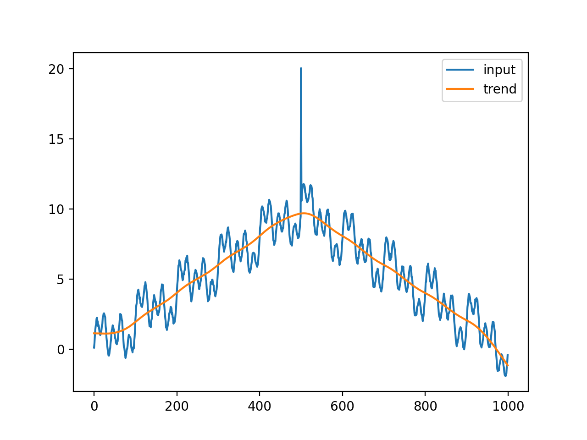
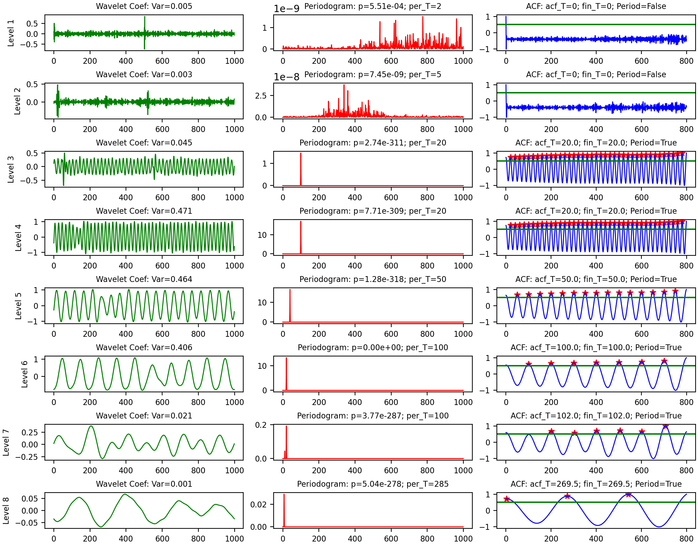
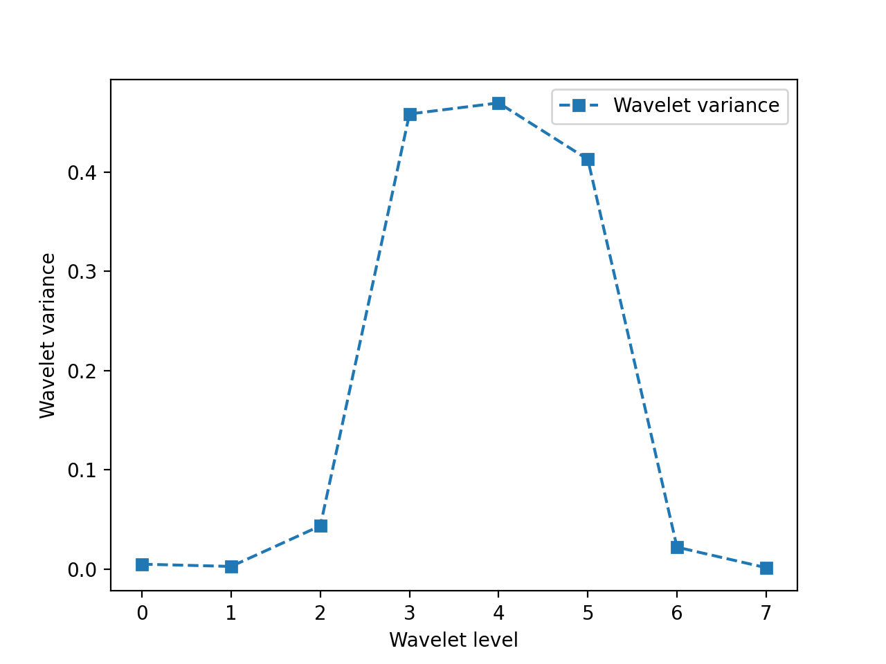

Unofficial Implementation of RobustPeriod: Time-Frequency Mining for Robust Multiple Periodicities Detection

## Installation
`pip install --upgrade git+https://github.com/ariaghora/robust-period.git`

## Usage example
```python
import numpy as np
import matplotlib.pyplot as plt
from robustperiod import robust_period, robust_period_full, plot_robust_period
from robustperiod.utils import sinewave, triangle
from statsmodels.datasets.co2.data import load_pandas

m = 1000
y1 = sinewave(m, 20, 1)
y2 = sinewave(m, 50, 1)
y3 = sinewave(m, 100, 1)
tri = triangle(m, 10)
noise = np.random.normal(0, 0.1, m)
y = y1+y2+y3+tri+noise
y[m // 2] += 10  # sudden spike

plt.plot(y)
plt.title('Dummy dataset')
plt.show()

lmb = 1e+6
c = 2
num_wavelets = 8
zeta = 1.345

periods, W, bivar, periodograms, p_vals, ACF = robust_period_full(
    y, 'db10', num_wavelets, lmb, c, zeta)
plot_robust_period(periods, W, bivar, periodograms, p_vals, ACF)
```

## Input
<p align="center">
  
</p>

## Output
<p align="center">
  
</p>

<p align="center">
  
</p>
